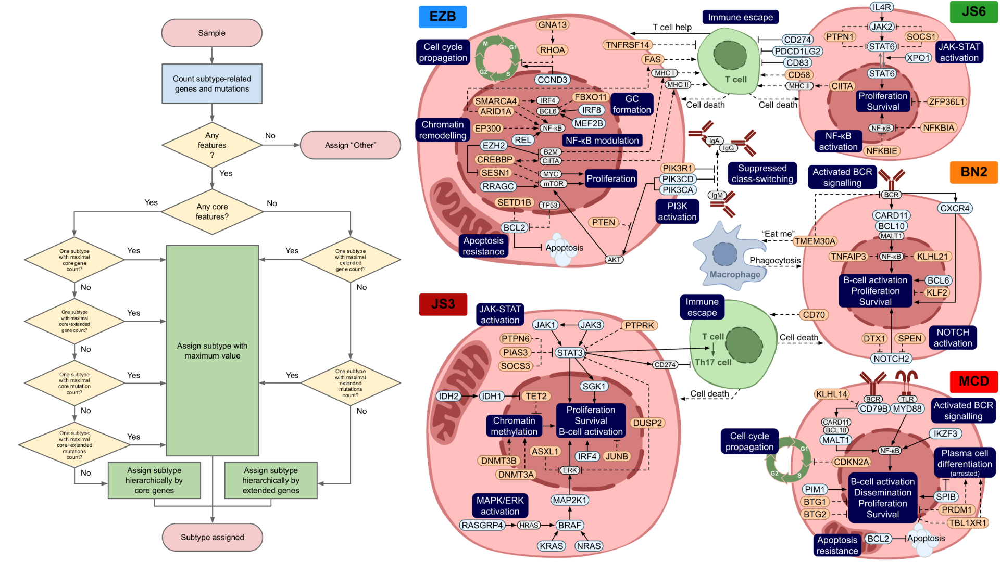

# Lymphly: Interpretable Genetic Classifier for DLBCL


---

## Background

DLBCL is a genetically and clinically heterogeneous disease. **Lymphly** is a transparent, evidence-based classifier developed to enhance biological resolution and improve patient stratification for clinical trials and treatment selection. Built on recent genomic insights, Lymphly complements existing approaches such as LymphGen and DLBclass, offering a flexible framework that integrates core mutations, CNAs, and translocations.

---

## Key Features

- Nine-step hierarchical algorithm based on core and extended genomic features
- Classification into six subtypes: EZB, MCD, BN2, N1, JS3, JS6
- Additional flags for high-risk cases: TP53+, A+, MYC+ statuses
- Integrated biological knowledge: derived from over 300 publications and 850 genomic events
- Handles genetically composite cases
- Compatible with whole-exome sequencing (WES) input, whole-genome sequencing (WGS), targeted panels, and circulating tumor DNA (ctDNA)

---

## Subtype Descriptions

| Subtype | Key Features | Biological Interpretation |
|--------|---------------|---------------------------|
| EZB    | BCL2, EZH2 mutations | GCB-like, epigenetic dysregulation |
| MCD    | MYD88, CD79B mutations | ABC-like, BCR/TLR activation |
| BN2    | BCL6, NOTCH2 mutations | NF-κB activation, NOTCH signaling |
| N1     | NOTCH1 mutations | Poor prognosis |
| JS3    | STAT3, IL6/IL10 loops | ABC-like, PI3K activation, BCR-resistance |
| JS6    | STAT6, PDL1 amplification | GCB-like/PMBL-like, immune evasion |

Additionally, **TP53+**, **A+**, and **MYC+** samples are flagged due to their prognostic and therapeutic significance.

---

## Repository Contents

- `images/`: Visual assets and figures used in documentation and the README, including algorithm diagram and subtype classification schema
- `test_data/`: Example input/output files
- `License.md`: Legal terms for using, modifying, and distributing Lymphly
- `Lymphly Notice file.docx`: Legal notice listing third-party Python libraries used in Lymphly, including license and attribution information.
- `Lymphly_feature_table.tsv`: The table defines the complete list of features used by Lymphly to assign molecular subtypes to DLBCL samples. Each row corresponds to a biologically relevant event (mutation, CNA, or translocation).
- `Lymphly_Classifier.ipynb`: Python notebook for subtype classification based on mutation, CNA, and translocation data
- `lymphly.py`: Core module with all functions used for DLBCL subtype classification, including feature processing, subtype assignment, and utilities
- `make_venv.sh`: Script for setting up a Python virtual environment and Jupyter kernel for Lymphly
- `requirements.txt`: contains a list of all Python packages required to run the Lymphly classifier and reproduce the analysis

---

## Installation

Before installing, make sure you have the following installed on your system:

- `Python` ≥ 3.10 (Python 3.10.11 recommended)

- `pip` — Python package manager

- `venv` — module for creating virtual environments (included in standard Python)

- `Jupyter` — expected to be available for running the Lymphly notebook

To install Lymphly locally:

```bash
git clone
cd Lymphly
chmod +x make_venv.sh
./make_venv.sh
```

This will create a virtual environment named Lymphly in the current directory and install all required dependencies.

---

## Environment

- Python 3.10.11 recommended

---

## Input File Specifications

### mutation.maf — Somatic Mutation Annotation

Tab-delimited text file in MAF (Mutation Annotation Format) style, containing somatic mutation data for all samples.
The classifier is designed to work primarily with mutation data aligned to the **GRCh38 (hg38)** human genome assembly. 

- However, it **can also process data aligned to the older GRCh37 (hg19)** assembly without issues.
- The classifier handles coordinates and annotations transparently, ensuring compatibility with both genome builds.

#### Required columns:

- `Tumor_Sample_Barcode` or `Sample`:  
  Sample ID. One of these columns must be present. Will be renamed to `Sample`.

- `Chromosome`:  
  Chromosome number or identifier. Will be normalized to `chrN` format.

- `Start_Position`:  
  Genomic start coordinate of the mutation. Required to compute `End_Position`.

- `Reference_Allele`:  
  Reference allele sequence. Used in variant localization and classification.

- `Tumor_Seq_Allele2` or `Tumor_Seq_Allele1`:  
  Observed alternative allele. Will be standardized to `Tumor_Seq_Allele2`.

- `Hugo_Symbol`:  
  HGNC gene symbol.

- `Variant_Classification`:  
  Mutation effect (e.g., `Missense_Mutation`, `Nonsense_Mutation`).

  The `Variant_Classification` column in `mutation.maf` must contain one of the supported values listed below. These are grouped internally into functional categories:

  - **MISSENSE**: includes `Missense_Mutation`, `Intron`, `3'UTR`, and `5'UTR`.  
    These represent coding and non-coding mutations that are often retained for exploratory analysis or because they are subtype-relevant.

  - **NONSENSE**: includes only `Nonsense_Mutation`.  
    This indicates mutations that introduce a premature stop codon, likely truncating the protein.

  - **FRAME_SHIFT**: includes `Frame_Shift_Ins`, `Frame_Shift_Del`, and `Splice_Site`.  
    These are disruptive mutations, including frameshifts and splicing errors, that can significantly alter protein function.

  Any `Variant_Classification` not listed above will be ignored during subtype classification.

#### Optional columns:

- `End_Position`:  
  If not provided, it will be computed as:  
  `End_Position = Start_Position + len(Reference_Allele) - 1`

---

### cna-gene.tsv — Copy Number Alteration Gene Matrix

Tab-separated file where rows are genes and columns are samples.

Each cell contains an integer copy number call, representing the relative copy number status of that gene compared to the sample’s baseline ploidy.

#### Expected values (example schema):

- `0` — diploid (normal copy number, relative to the sample’s ploidy)

- `1` or `2` — gain or amplification (increased copy number relative to ploidy)

- `-1` or `-2` — loss or deletion (reduced copy number relative to ploidy)

This matrix is used to identify subtype-defining copy number alterations in specific genes.

---

**Note:** Negative values (-1, -2) represent copy number loss or deletion relative to the estimated ploidy of the sample. For example, if a sample has a baseline ploidy of 3, a value of -1 may indicate a reduction to 2 copies in that region.

---

### cna-arm.tsv — Copy Number Alteration Arm Matrix

Tab-separated file where rows represent chromosome arms and columns represent samples.

Each cell contains an integer copy number call, indicating the relative copy number status of a chromosome arm compared to the sample’s ploidy.

The ploidy is not fixed (e.g., typically 2) but is calculated specifically for each sample. It is typically determined using the weighted average of copy numbers across the genome:

- For every segment in the sample, multiply its Total Copy Number by the segment's length.

- Sum these values and divide by the total length of the genome.

- The result is rounded to the nearest integer to define the sample's ploidy used in the scoring function.

The cna-arm.tsv file is required to compute the arm-level aneuploidy status A+/–. If this file is not provided, the A+/– status cannot be calculated, and any downstream analyses depending on this metric will be unavailable.

For each sample, any non-zero deviation from the baseline ploidy contributes +1 to the aneuploidy score. Thus, the total A+/– score equals the number of chromosome arms whose copy number differs from the sample’s ploidy

A sample is considered `A+` if its score is > `14`

A sample is considered `A−` if its score is ≤ `14`

This functionality is available for any cohort that includes arm-level CNA calls

#### Expected values (example schema):

- `0` — Neutral: The arm's copy number matches the sample's ploidy.

- `-1` — Loss (Hemizygous Deletion): The arm is missing one copy relative to the ploidy. In a diploid sample (Ploidy ≈ 2), a Total Copy Number of 1 is a Loss (-1). In a tetraploid sample (Ploidy ≈ 4), a Total Copy Number of 3 is a Loss (-1).

- `-2` — Deletion (Homozygous/Deep Deletion): The arm is missing two copies relative to the sample's ploidy.

- `1` — Gain: The arm has one extra copy compared to the ploidy.

- `2` — Amplification: The arm has two or more extra copies (high-level amplification).

This matrix is used to compute broad aneuploidy metrics, identify recurrent arm-level CNAs, and support subtype classification driven by chromosomal gains and losses.

#### Allowed chromosome arm names

Chromosome arms must follow the format:

`{1–24}{p/q}`

where:

- `1–22` represent autosomes

- `23` represents chromosome X

- `24` represents chromosome Y

Examples of valid names: 1p, 1q, 7p, 19q, 22p, 23q, 24p.

#### Invalid chromosome arm names

The following are not allowed:

- Literal X or Y arm names (`Xp`, `Xq`, `Yp`, `Yq`)

- Chromosome numbers without an arm (`1`, `7`, `23`, `24`)

- Cytobands (`1p36`, `8q24`)

- Any non-numeric or non-arm identifiers (e.g., contigs, scaffolds, or mitochondrial labels)

---

**Note:** Negative values (-1, -2) represent copy number loss or deletion relative to the estimated ploidy of the sample. For example, if a sample has a baseline ploidy of 3, a value of -1 may indicate a reduction to 2 copies in that region.

---

### annotation.tsv — Annotation file

The sample annotation file is a **tab-separated text file** containing exactly four columns:

#### Required Column

- `Sample`
- `BCL2`  
- `BCL6`
- `MYC`

This file serves two purposes:

Defines the list of samples to be included in the classification.
Only samples listed in this file will be processed.

Provides translocation status for the genes `BCL2`, `BCL6`, and `MYC`.

Values indicating presence of the translocation should be:

- `True`, `TRUE`, `true`, or the string `"True"`  
Any other values are ignored (treated as no translocation).

---

**Note:** Each row corresponds to a single sample. The `Sample` column must exactly match sample IDs used elsewhere in the analysis (e.g. in `mutation.maf` or `cna-gene.tsv`).

---

## Usage

Run the main notebook using Jupyter:


```bash
source Lymphly/bin/activate
jupyter notebook Lymphly_Classifier.ipynb
```

**Important**: Make sure the `Lymphly` environment is selected in the Jupyter Notebook interface

Provide input files with mutation, CNA, and translocation information for your DLBCL samples. The notebook will classify each sample and annotate subtype and risk features (TP53+, A+, MYC+).

Input file paths and parameters can be specified in the notebook via the cohorts_settings dictionary, for example:

```python
cohorts_settings = {
    'path_to_maf': 'test_data/mutations.maf',
    'path_to_cna_gene': 'test_data/cna-gene.tsv',
    'path_to_cna_arm': 'test_data/cna-arm.tsv',
    'path_to_annotation': 'test_data/annotation.tsv',
    'name_to_save': 'test_data/Lymphly_test.tsv',
    'ref': 'HG38'
}
```
The fields `path_to_maf`, `path_to_cna_gene`, 'path_to_cna_arm', and `path_to_annotation` should contain paths to input files formatted as described in the *Input File Specifications* section.  
`name_to_save` is the output path for the resulting classifier file.  
`ref` specifies the reference genome used in the input MAF file (either `HG38` or `HG19`).


Set additional parameters to control classification behavior:

- `USE_TRANSLOCATIONS`
- `USE_CNA`
- `USE_STATUSES`

Modify these parameters as needed to enable or disable usage of translocations, copy number alterations, and status flags (**TP53+**, **A+**, and **MYC+**) during classification.

---

## Performance

96% classification rate across internal and public datasets (n=840)

Subtypes correlate with survival outcomes and known biology

Detects cases missed by LymphGen and DLBclass

Highlights novel high-risk and immune-evasion subtypes (JS3, JS6)

---

## Contact

For questions or collaboration inquiries, please contact:
Pavel Zemskiy – pavel.zemskiy@bostongene.com

## Licencse
 
BY UTILIZING THE CODE, YOU ARE CONSENTING TO BE AND AGREE TO BE BOUND BY ALL OF THE TERMS OF THIS LIMITED LICENSE, SEE "License.md" FILE